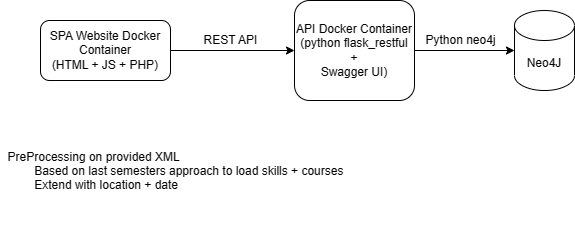

# awt-project-ws22-23-smart-learning-g1

The proposed approach in this project is a filter recommendation service to improve the search results for the WDB Suchportal website. The recommender system is designed to take into account the descriptions of the courses, user profiles, and competencies. The service analyses the date from the user’s CV in Europass to generate personalized search filter options for each user.

## Pre-Requisites

Docker + docker-compose

### Quick installation
Install Docker desktop from https://www.docker.com/products/docker-desktop/

#### Manual installation
Follow the steps from https://docs.docker.com/engine/installation/linux/ubuntu/.

In my case, Docker CE has been installed.

Version check:
```shell
$ docker -v
Docker version 17.03.1-ce, build c6d412e
```

Follow the steps from https://docs.docker.com/compose/install/.
```shell
$ sudo curl -L "https://github.com/docker/compose/releases/download/1.11.2/docker-compose-$(uname -s)-$(uname -m)" -o /usr/local/bin/docker-compose
```
Apply executable permissions to the binary:
```shell
$ sudo chmod +x /usr/local/bin/docker-compose
```
Check the version:
```shell
$ docker-compose -v
docker-compose version 1.11.2, build dfed245
```
## Let it run
```shell
docker-compose up --build
```

During the initial boot-up of the system, the database is preloaded with data that has been preprocessed from prior project teams' work, which ensures that users have access to a comprehensive dataset from the onset. 

Multiple containers will be spun-up after deployment:
| URL                    | Component |
|------------------------|-----------|
| http://localhost:5003/ | Website       |
| http://localhost:5001/ | OpenAPI Documentation        |
| http://localhost:7474/ & http://localhost:7687/ | Neo4J Database        |

## Architecture


## References
* [Simple Flask SPA](https://www.bogotobogo.com/DevOps/Docker/Docker-Compose-FlaskREST-Service-Container-and-Apache-Container.php)
* [Last semesters group work](https://github.com/ingastrelnikova/awt-pj-ss22-learn-tech-2)
